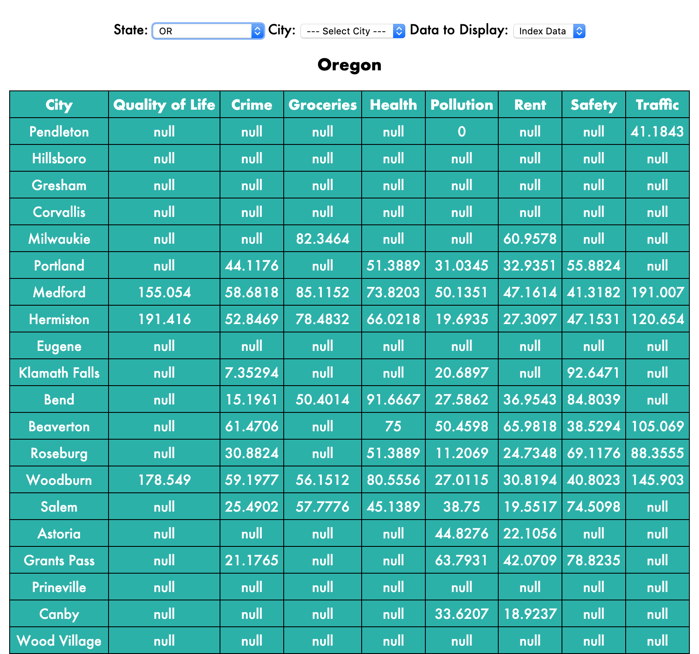
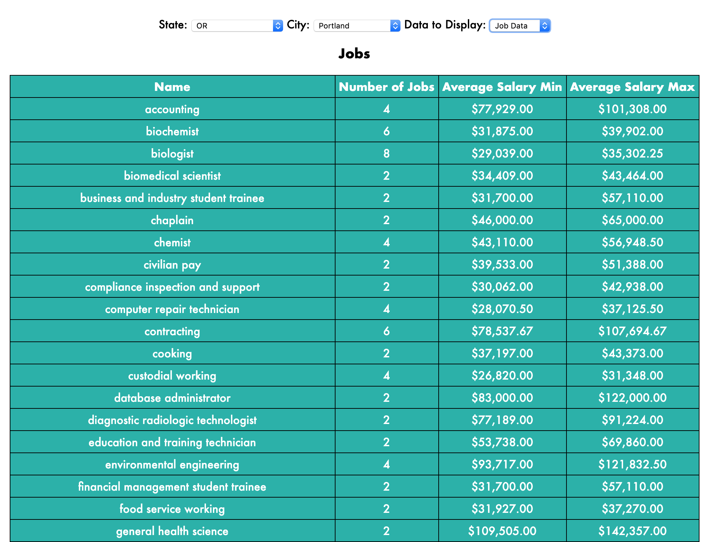
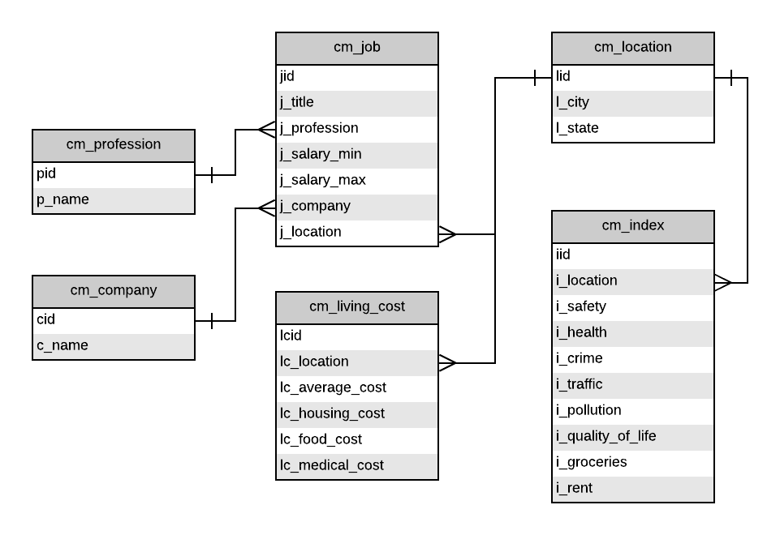

# Career Mapper
The Career Mapper project is meant to provide a relational schema whereby queries for career information (such as job postings, job types, job location, etc.) produce not only information about the job, but also information relative to living in the area where the job as located. In essence it integrates data from data sources such as the average cost of living; the health, crime, safety, and traffic indices; and the job quality and company status related to a particular job posting. 
The goal is to provide greater clarity and insight into the career decision making process. Ultimately we attempt to discover geographic patterns related to one of the most important aspects of our lives—pursuing our careers.

## Code Explanation:
### `index.php`
This is the main driver code for the website. It handles all the interaction with the API as well as the display of the data. It displays a map which can display different indexes averaged over states which are then color-coded and compared against each other. Below the map is a series of drop-down menus which allow the user to select a state and a city to show different types of data for. That data is either the various indexes we collected from sources such as [Numbeo](https://www.numbeo.com/cost-of-living/) or job data which we have collected from other sources such as [USAJOBS](https://www.usajobs.gov/). States that show up blank when an index is selected have no data for that index.

### `api.php` & `db_interactions.php`
These are the main sources for the backend. `api.php` calls functions from `db_interactions.php` which interface directly with our database. This data can be called either via the API or visualized in `index.php`.

### `getusajobs.py`, `numbeo.py`, and `LivingFactors.py`
This was the code used to grab data from [USAJOBS](https://www.usajobs.gov/), [Numbeo](https://www.numbeo.com/cost-of-living/), and [USAToday](https://www.usatoday.com/story/money/economy/2018/05/10/cost-of-living-value-of-dollar-in-every-state/34567549/). It then writes the data collected into a CSV file.

### `database/`
The files in the `database/` folder just take the CSV files that were generated from the scripts above and load them into our database according to our defined schema.

#### Schema:

